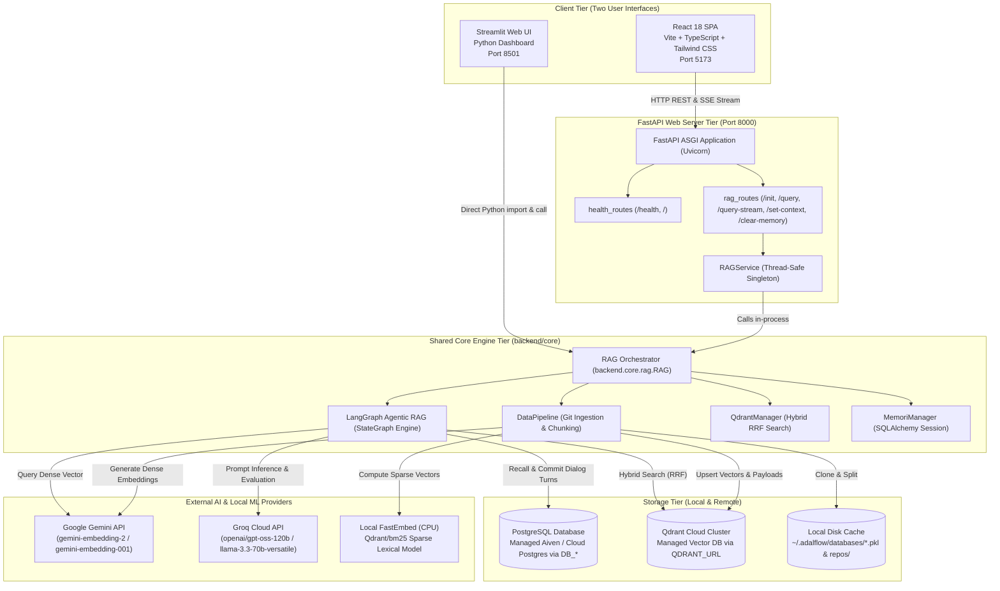
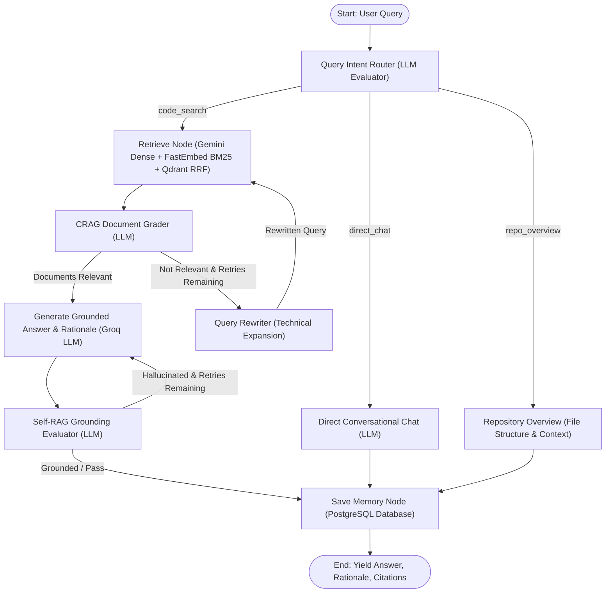
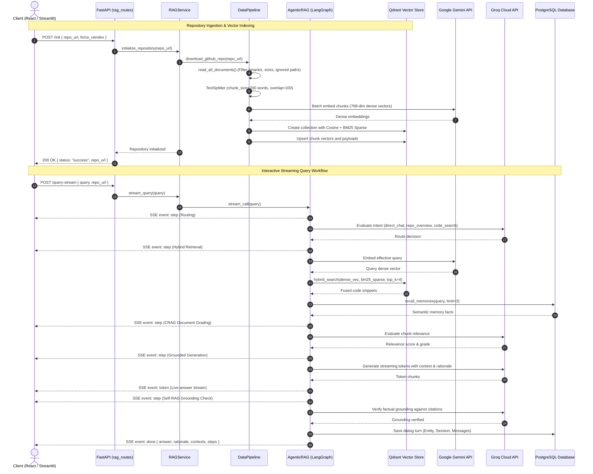
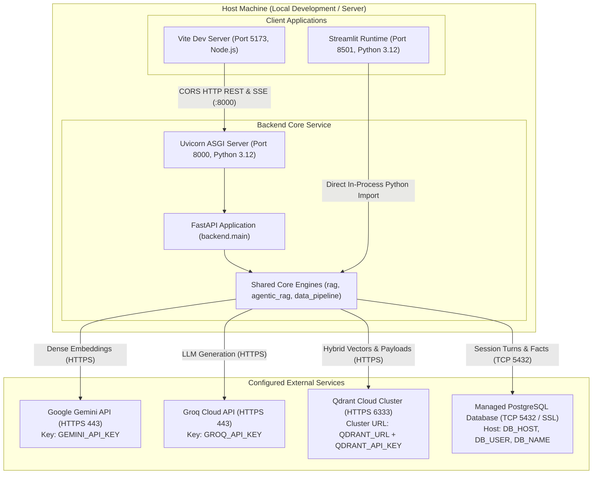

# GithubChat System Architecture

Production architectural specification and component reference for GithubChat, based strictly on the codebase implementation.

---

## System Overview Architecture

GithubChat is a codebase intelligence platform implementing Agentic Retrieval-Augmented Generation (RAG). It provides semantic code search, autonomous agent routing, hybrid vector retrieval, and conversational memory storage.

The diagram below reflects the architecture as implemented in the repository:

---

## Agentic RAG Pipeline Architecture (LangGraph StateGraph)

The RAG engine in `backend/core/agentic_rag.py` executes a compiled LangGraph `StateGraph`.

---

## End-to-End Sequence Diagram

The diagram below details the two primary workflows: **Repository Ingestion** and **Interactive Streaming Query**.

---

## Storage & State Architecture

```mermaid
graph TD
    subgraph Vector_Storage["Vector Storage Engine"]
        QdrantInstance["Qdrant Client (Connected to QDRANT_URL)"]
        DenseIndex["Dense Vector Index (Cosine Metric, 768 Dimensions)"]
        SparseIndex["Sparse Vector Index (BM25 Lexical Inverted Index)"]
        Payloads["Document Payloads (File Path, Source Text, Code Metadata)"]
        FusionEngine["Reciprocal Rank Fusion (RRF) Scorer"]

        QdrantInstance --> DenseIndex
        QdrantInstance --> SparseIndex
        QdrantInstance --> Payloads
        DenseIndex --> FusionEngine
        SparseIndex --> FusionEngine
    end

    subgraph Relational_Storage["Memori Labs SQL Schema"]
        Engine["SQLAlchemy Engine (PostgreSQL via DB_* / In-Memory)"]
        T_Entity["memori_entity (Entity ID, External UUID)"]
        T_Process["memori_process (Process ID, Runtime Metadata)"]
        T_Session["memori_session (Deterministic DNS UUIDv5)"]
        T_Conv["memori_conversation (Session ID, Summary)"]
        T_Msg["memori_conversation_message (Role, Content, Timestamps)"]

        Engine --> T_Entity
        Engine --> T_Process
        Engine --> T_Session
        Engine --> T_Conv
        Engine --> T_Msg

        T_Entity -.->|1:N| T_Session
        T_Process -.->|1:N| T_Session
        T_Session -.->|1:N| T_Conv
        T_Conv -.->|1:N| T_Msg
    end

    subgraph File_Cache["Local File System Artifacts"]
        ClonedRepos["AdalFlow Root: ~/.adalflow/repos/{repo_name}"]
        PKLCache["AdalFlow Root: ~/.adalflow/databases/{repo_name}.pkl"]
        FastEmbedCache[".fastembed_cache/ (Cached BM25 tokenizers)"]
    end
```

---

## Host Runtime & Network Topology

---

## Component Specifications

### Client Interfaces
- **React 18 SPA (`frontend/`)**:
  - Built with React 18, Vite, TypeScript, and Tailwind CSS.
  - Connects to the backend via HTTP REST and Server-Sent Events (`frontend/src/services/api.ts`).
  - Visualizes real-time progress steps, streaming tokens, model connection health, and file citations.
- **Streamlit Dashboard (`streamlit_app/`)**:
  - Built with Python and Streamlit.
  - Directly imports and invokes the core RAG engine in-process (`RAG(entity_id="streamlit_user", process_id="streamlit_app")`).
  - Provides model key testing widgets, chat history management, and transcript downloads.

### API Gateway
- **FastAPI Application (`backend/main.py`)**:
  - Handles CORS middleware for frontend communication.
  - Implements global exception handlers and startup key checks.
  - Routes:
    - `/health`, `/`: Environment validation and API status.
    - `/init`: Repository ingestion and hybrid vectorization.
    - `/query`: Synchronous RAG semantic answer generation.
    - `/query-stream`: Real-time SSE streaming endpoint.
    - `/set-context`, `/clear-memory`: Conversation history synchronization.

### Core Engines & Services
- **RAGService (`backend/services/rag_service.py`)**:
  - Thread-safe Singleton managing the lifecycle of the underlying RAG orchestrator for FastAPI requests.
- **RAG Orchestrator (`backend/core/rag.py`)**:
  - Bridges ingestion preparation, embedding verification, and delegation to the autonomous LangGraph agent pipeline.
- **LangGraph Agentic RAG (`backend/core/agentic_rag.py`)**:
  - Implements a state machine covering query routing, hybrid retrieval, Corrective RAG (CRAG) document grading, query rewriting, grounded generation, and Self-RAG hallucination evaluation.
- **Data Pipeline (`backend/core/data_pipeline.py`)**:
  - Shallow clones Git repositories, filters ignored files, chunks documents, generates dense embeddings in batches of 100, and caches state in `~/.adalflow/databases/*.pkl`.
- **Qdrant Manager (`backend/core/qdrant_manager.py`)**:
  - Manages dual-vector collections (Dense 768-dim + BM25 Sparse).
  - Connects to your managed Qdrant Cloud cluster via `QDRANT_URL` and `QDRANT_API_KEY`.
- **Memori Manager (`backend/core/memory_manager.py`)**:
  - Manages conversation state, session turns, and semantic facts in a managed PostgreSQL database (e.g., Aiven) via SQLAlchemy, using transient in-memory storage during automated testing without creating any disk files.

### External AI Providers
- **Google Gemini API (`GEMINI_API_KEY`)**:
  - Generates 768-dimensional dense vector embeddings using `gemini-embedding-2` with `gemini-embedding-001` fallback.
- **Groq Cloud API (`GROQ_API_KEY`)**:
  - Provides low-latency LLM inference for agent routing, document grading, query rewriting, and answer generation.
- **Local FastEmbed (`fastembed`)**:
  - Generates BM25 sparse vectors locally on CPU without external API latency.

---

## Authentication & Credentials Model

The application relies strictly on environment variables specified in `backend/.env.example`:

| Variable | Required | Purpose |
| :--- | :--- | :--- |
| `GEMINI_API_KEY` | Yes | Dense vector embeddings with Google Gemini |
| `GROQ_API_KEY` | Yes | LLM inference with Groq Cloud |
| `QDRANT_URL` | Yes | Managed Qdrant Cloud cluster URL |
| `QDRANT_API_KEY` | Yes | API key for managed Qdrant Cloud cluster |
| `DB_USER` | Yes | PostgreSQL username (e.g. Aiven) |
| `DB_PASSWORD` | Yes | PostgreSQL password |
| `DB_HOST` | Yes | PostgreSQL host endpoint |
| `DB_PORT` | No | PostgreSQL port (defaults to 5432) |
| `DB_NAME` | No | PostgreSQL database name (defaults to defaultdb) |
| `SSL_MODE` | No | PostgreSQL SSL connection mode (defaults to require) |
| `DATABASE_URL` | Optional | Direct full connection URI alternative |

Client access to the FastAPI server is open over local network / CORS without authentication.

---

## Deployment & Infrastructure Note

Containerization files (`Dockerfile`, `docker-compose.yml`) and distributed message brokers (Celery, Redis) are not implemented in the repository. The platform runs natively across two or three local processes:
- Backend: `uvicorn backend.main:app --port 8000`
- React Frontend: `npm run dev` (Vite, port 5173)
- Streamlit UI: `streamlit run streamlit_app/main.py` (port 8501)
