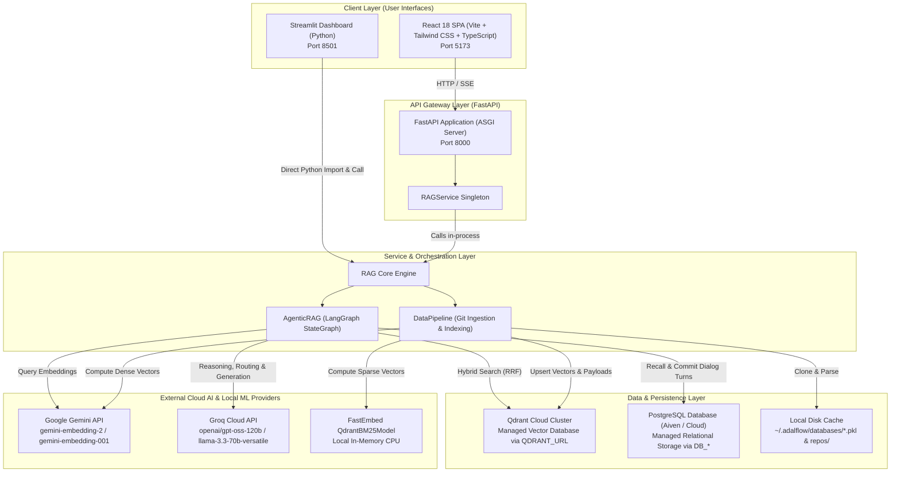
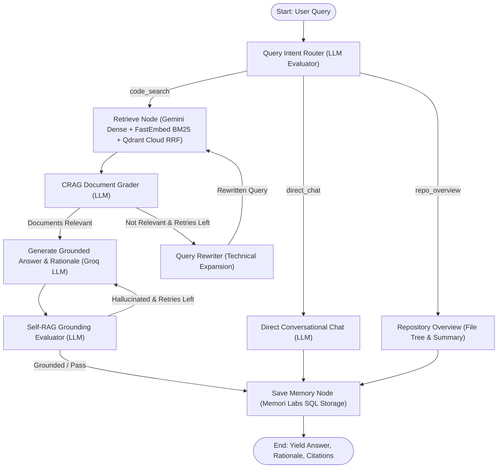

# GithubChat

Production-grade Codebase Intelligence and Agentic Retrieval-Augmented Generation (RAG) platform. Clone, semantically index, and interact with any GitHub repository or local codebase in real time with exact file citations, autonomous agent routing, hybrid vector retrieval, and persistent conversational memory.

---

## Core Capabilities

- **Autonomous Agentic RAG (LangGraph)**:
  - **Query Intent Router**: Dynamically routes requests to direct conversational chat, repository structural overviews, or deep code retrieval.
  - **Corrective RAG (CRAG) Document Grader**: Evaluates retrieved code snippets for semantic relevance before generating answers.
  - **Query Reformulation Loop**: Iteratively expands and rewrites queries when retrieved context is insufficient.
  - **Self-RAG Grounding Evaluator**: Validates generated answers against retrieved source snippets to prevent hallucinations.
- **Qdrant Cloud Cluster Hybrid Search (RRF)**:
  - Connects to your managed **Qdrant Cloud cluster** via `QDRANT_URL` and `QDRANT_API_KEY`.
  - Combines 768-dimensional dense vectors from Google Gemini (`gemini-embedding-2` / `gemini-embedding-001`) with FastEmbed BM25 sparse lexical vectors.
  - Fuses dense and sparse rankings using Reciprocal Rank Fusion (RRF) for high recall across exact symbol names and semantic concepts.
- **Memori Labs Relational SQL Memory**:
  - Persists conversational entities, processes, sessions, conversations, and dialog turns in a managed PostgreSQL database (such as Aiven) via SQLAlchemy (with transient in-memory storage for test runs).
  - High-level semantic memory recall enriches prompt context with known facts across sessions.
- **Real-Time Token & Thought Streaming**:
  - Server-Sent Events deliver real-time progress steps, reasoning summaries, live token streams, and source citations.
- **Dual User Interfaces**:
  - **React 18 SPA**: Modern TypeScript + Tailwind CSS application with real-time progress indicators, collapsible reasoning cards, and syntax-highlighted citations.
  - **Streamlit Dashboard**: Standalone Python web dashboard with model connection indicators, history controls, and transcript exports.

---

## Architecture Overview



For complete technical specifications, see [ARCHITECTURE.md](ARCHITECTURE.md).

---

## Agentic RAG Pipeline



---

## Repository Structure

```
github-chat/
├── backend/                        # FastAPI server, AI core & Python environment
│   ├── main.py                     # FastAPI application entrypoint & middleware
│   ├── core/                       # Core AI and RAG engine
│   │   ├── rag.py                  # Orchestrator integrating LangGraph & memory
│   │   ├── agentic_rag.py          # LangGraph StateGraph (Router, CRAG, Self-RAG)
│   │   ├── qdrant_manager.py       # Qdrant Hybrid Search with RRF fusion
│   │   ├── memory_manager.py       # Memori Labs SQL memory schema and operations
│   │   ├── data_pipeline.py        # Repository ingestion, filtering, and chunking
│   │   ├── gemini_embedder.py      # Google Gemini Embedder with auto-batching
│   │   ├── groq_client.py          # Groq Cloud LLM client
│   │   ├── config.py               # Model configurations and runtime defaults
│   │   ├── constants.py            # Centralized file extensions, limits, and exclusions
│   │   └── system_prompt.py        # System prompts and prompt templates
│   ├── routes/                     # API route controllers
│   ├── services/                   # Business logic and service singletons
│   ├── dto/                        # Typed Pydantic request/response schemas
│   ├── utils/                      # Key validation, URL parsing, and error handlers
│   ├── tests/                      # Pytest automated test suite
│   ├── pyproject.toml              # Backend environment and dependency specification
│   ├── requirements.txt            # Pinned requirements
│   ├── uv.lock                     # Reproducible UV lockfile
│   └── .env.example                # Environment variables template
│
├── frontend/                       # React 18 production web application
│   ├── src/
│   │   ├── App.tsx                 # Root application component
│   │   ├── components/             # LandingPage, ChatPage, Sidebar, ChatMessage
│   │   ├── services/api.ts         # Centralized API client (Fetch & SSE parser)
│   │   ├── main.tsx                # React DOM entrypoint
│   │   └── index.css               # Tailwind CSS stylesheet
│   ├── package.json                # Frontend package configuration
│   ├── vite.config.ts              # Vite configuration
│   └── tsconfig.json               # TypeScript configuration
│
├── streamlit_app/                  # Interactive Streamlit UI
│   ├── main.py                     # Streamlit application dashboard
│   ├── styles.py                   # Dark glassmorphism styling
│   ├── components/                 # Sidebar and message view components
│   └── requirements.txt            # Dependencies for Streamlit
│
├── ARCHITECTURE.md                 # Production architecture documentation
├── pyrightconfig.json              # Pyright language server configuration
├── .gitignore                      # Git exclusion rules
└── README.md                       # Project documentation
```

---

## Prerequisites

- **Python**: 3.12 or higher
- **Node.js**: 18 or higher (for the React frontend)
- **Git**: Installed and available in PATH
- **Cloud Service Credentials**:
  - `GEMINI_API_KEY`: Google AI Studio API key (for dense embeddings)
  - `GROQ_API_KEY`: Groq Cloud API key (for fast LLM inference)
  - `QDRANT_URL`: Managed Qdrant Cloud cluster endpoint
  - `QDRANT_API_KEY`: Managed Qdrant Cloud API key
  - Managed PostgreSQL: `DB_USER`, `DB_PASSWORD`, `DB_HOST`, `DB_PORT`, `DB_NAME`, `SSL_MODE` (or `DATABASE_URL`)

---

## Quickstart & Setup Guide

### Clone the Repository

```bash
git clone https://github.com/LaxmiNarayana31/github-chat.git
cd github-chat
```

---

### Configure Environment Variables

Create your `.env` configuration file from the template:

```bash
# On Linux / macOS
cp backend/.env.example backend/.env

# On Windows PowerShell
Copy-Item backend\.env.example backend\.env
```

Open `backend/.env` and insert your credentials:

```env
# Google AI Studio
GEMINI_API_KEY=your_gemini_api_key_here

# Groq Cloud
GROQ_API_KEY=your_groq_api_key_here

# Qdrant Cloud
QDRANT_URL=https://your-cluster-id.eu-west-2-0.aws.cloud.qdrant.io
QDRANT_API_KEY=your_qdrant_api_key_here

# Managed PostgreSQL (e.g. Aiven)
DB_USER=your_db_user
DB_PASSWORD=your_db_password
DB_HOST=your_db_host.aivencloud.com
DB_PORT=5432
DB_NAME=defaultdb
SSL_MODE=require
```

| Key | Where to Get | Purpose |
| :--- | :--- | :--- |
| `GEMINI_API_KEY` | [Google AI Studio](https://aistudio.google.com/app/apikey) | Dense semantic vector embeddings |
| `GROQ_API_KEY` | [Groq Cloud Console](https://console.groq.com/keys) | Agent routing, CRAG grading, & generation |
| `QDRANT_URL` & `QDRANT_API_KEY` | [Qdrant Cloud Console](https://cloud.qdrant.io) | Managed hybrid vector retrieval cluster |
| `DB_*` / `DATABASE_URL` | [Aiven Console](https://console.aiven.io) | Managed PostgreSQL relational memory storage |

---

### Backend Setup & Startup (FastAPI)

Navigate to the `backend` directory:

```bash
cd backend
```

Choose your preferred package manager to install dependencies:

#### Using uv (Fastest)

```bash
uv sync
uv run uvicorn main:app --host 0.0.0.0 --port 8000 --reload
```

#### Using standard pip & virtualenv

```bash
# Create virtual environment
python -m venv .venv

# Activate on Windows PowerShell:
.venv\Scripts\Activate.ps1

# Activate on Linux / macOS:
source .venv/bin/activate

# Install dependencies
pip install -r requirements.txt

# Launch FastAPI backend
uvicorn main:app --host 0.0.0.0 --port 8000 --reload
```

The backend server is now running at `http://localhost:8000`.
- Health Check: `http://localhost:8000/health`
- Interactive Swagger Docs: `http://localhost:8000/docs`

---

### Client Setup & Startup

You can use either the modern React SPA or the interactive Streamlit dashboard:

#### Option A: React 18 SPA (Recommended)

In a new terminal, navigate to the `frontend` folder:

```bash
cd frontend
npm install
npm run dev
```

Open `http://localhost:5173` in your browser. Enter any public GitHub repository URL (such as `https://github.com/fastapi/fastapi`), click **Index**, and begin chatting with full citations and streaming thoughts.

#### Option B: Streamlit Web Dashboard

In a new terminal, launch the Streamlit interface from the repository root:

```bash
# With uv
uv run --project backend streamlit run streamlit_app/main.py

# Or with activated virtual environment
streamlit run streamlit_app/main.py
```

Open `http://localhost:8501` in your browser.

---

### Verification & Testing

Verify that all services, pipelines, and agents are functioning properly by running the automated test suite:

```bash
# Run all unit and integration tests
backend/.venv/Scripts/pytest backend/tests

# Or with uv from repo root
uv run --project backend pytest backend/tests
```

All 34 tests validate the document ingestion pipeline, Gemini embedder batching, Qdrant hybrid retrieval, Memori SQL turn saving, API routes, and LangGraph agent execution.
